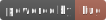

# bs-site-demo: A Customize Website Demo powered by Express / Pug / Bootstrap with JSON file

[](https://nodejs.org/) &nbsp; [](https://expressjs.com/) &nbsp; [](https://pugjs.org/) &nbsp; [](https://getbootstrap.com/) &nbsp; [](./LICENSE)

## Project Information

- Include website templates: 2 Sets (T1 & T2)

- Fit for: Small and Medium Sized Business / Personal Use

## Installation

```bash
# Install dependencies
npm install
# or run 'cnpm install' if you're living in China mainland.
```

## Local Web Server Running

```bash
# Start local web server
npm start
# or 
npm run start:pm2   # PM2 installed in advance.

# Then, open url `http://localhost:8000/` on Browser. That's it.
```

## Development Environment

- OS Platform: Deepin OS v15.11 ~ v23

- Coding Tool: Visual Studio Code

- Tested on node.js version: v14 ~ v20

- Stacks: Node.js + Express + Pug + JQuery + Bootstrap

- VCS: git / github

### Install & Rebuild

In case you are willing to reinstall or rebuild packages for the app, you are able to try below CLIs under current directory in a terminal/bash window.

```bash
npm install # or run 'cnpm install' if you're living in China mainland.
npm rebuild # or run 'cnpm rebuild' 
```

## Milestones

Last Modified Date: 2025-10-26

Initial Date: 2018-12-25

:airplane::wink::airplane::wink::airplane::wink:
