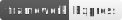

## bs-site-demo: A Customize Website Demo powered by Bootstrap and JSON file.

 &nbsp;&nbsp; &nbsp;&nbsp;

**Website information:**

- Template: 2 Sets (T1 & T2)

- Fit for: Small Business & Personal Use.

**Start local web server:**

```bash
# Start local web server
npm start
# or 
npm run start:pm2   # PM2 installed in advance.

# Then, Check out link `http://localhost:8000/` on Browser. That's all.
```

**Development:**

- Platform OS: Ubuntu 18.10 ~ 19.10 / Deepin 15.11 ~ 20.9

- Coding Tool: Visual Studio Code

- Framework: Node.js + Express + Pug + JQuery + Bootstrap

- VCS & PM Tools: git & npm

**Install and rebuild packages:**

In case you are willing to reinstall or rebuild packages for the app, you are able to try below CLIs under current directory in a terminal/bash window.

```bash
npm install # or run 'cnpm install' if you're living in China mainland.
npm rebuild # or run 'cnpm rebuild' 
```

:airplane::wink::airplane::wink::airplane::wink:
